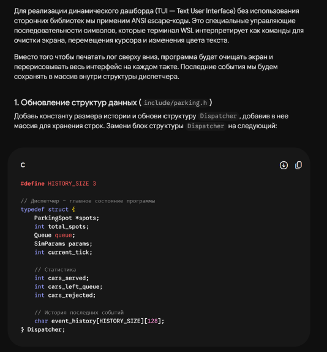
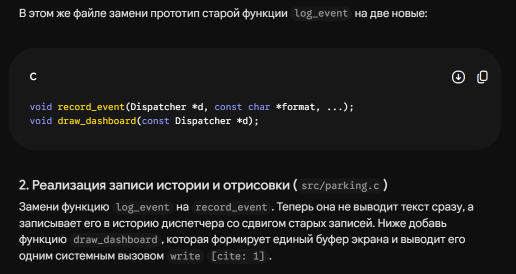
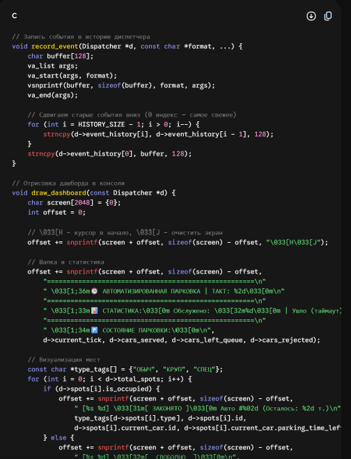
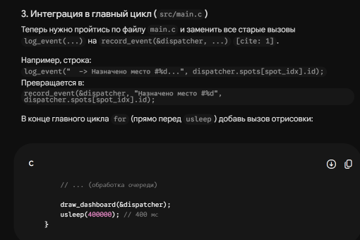
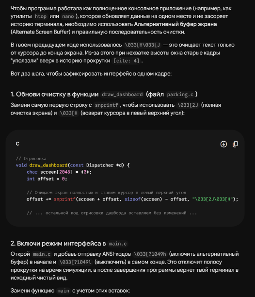
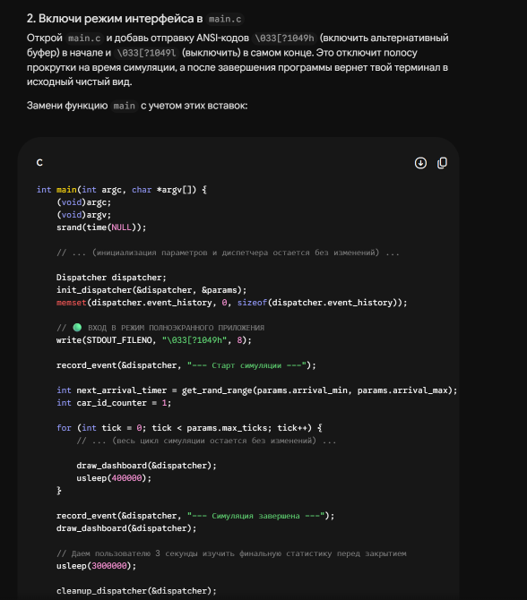
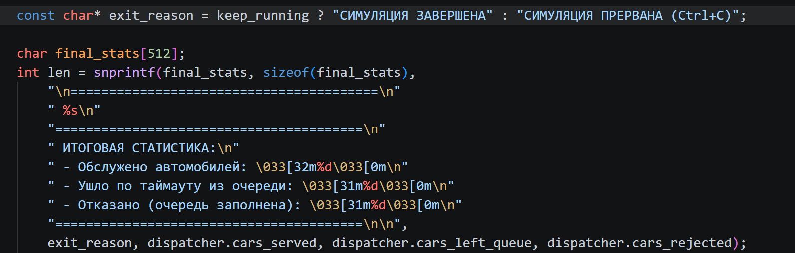

# ОТЧЁТ О ВЫПОЛНЕНИИ ИНДИВИДУАЛЬНОГО ЗАДАНИЯ №1

**Выполнил:** Серебряков Владимир Романович, студент БПИ252.

**Вариант:** 26

## Условие

Возле делового центра расположена автоматизированная парковка. Парковочные места разделены на несколько типов: обычные, места для крупногабаритных автомобилей и специальные места. Каждый автомобиль также относится к определённому типу и может занимать только совместимое с ним место. Автомобили прибывают через случайные интервалы времени. При въезде автомобиль сообщает диспетчеру свой уникальный номер и тип. Если подходящее место свободно, диспетчер разрешает въезд и назначает его автомобилю. Занятое место освобождается после истечения времени стоянки автомобиля. Если подходящих мест нет, автомобиль становится в очередь перед въездом. Размер очереди ограничен. Автомобиль покидает парковку, если очередь заполнена либо время его ожидания превысило допустимое значение. Освободившееся место назначается одному из ожидающих совместимых автомобилей в соответствии с выбранной стратегией обслуживания. Требуется разработать консольное приложение, моделирующее работу парковки.

## Сценарий

**Сущности:**

1. **Автомобиль (Car):** индетификатор, тип (обычный, крупный, спец), оставшееся время стоянки и текущее время.
2. **Парковочные места (ParkingSpot):** индетификатор, тип, статус, ссылка на припаркованный автомобиль.
3. **Очередь (Queue):** Кольцевой буфер заданного размера.
4. **Диспетчер (Dispatcher):** Глобальное состояние программы, управляет местами и автомобилями, очередью, статистикой и историей.

**Симуляция:**

Программа последовательно имитирует события с шагом (тактом). На каждом такте:

1. **Генерация автомобиля:** Если таймер прибытия истёк и сгенерированы не все автомобили нужных типов, создаётся объект Car, для непредсказуемого поведения используется генератор рандомных чисел для типа следующего прибывшего авто и для времени стоянки.
2. **Обслуживание очереди:** Проверяется истечение времени ожидания у автомобилей в очереди (при превышении – уход из очереди и запись в статистику). Если есть свободные места – автомобиль занимает подходящее по типу место.
3. **Освобождение мест:** Уменьшается счётчик времени стоянки припаркованных авто. Если время истекло, автомобиль покидает место, место освобождается для следующего авто.

**Пользовательский интерфейс:**

Программа разработана как интерактивное консольное приложение для OC Linux.

- **Базовый запуск:** `./parking_sim` (читать [readme.md](readme.md) для подготовки приложения к запуску)
- **Запуск через аргументы командной строки:** Реализован с помощью `getopt`, пользователь может настроить параметры: лимит тактов (`-t`), вместимость очереди (`-q`), распределение мест (`-r`, `-l`, `-s`), кол-во автомобилей (`-c`, `-C`, `-S`), и временные интервалы (`-a`, `-b`, `-p`, `-P`, `-w`).
- **Отображение данных:** Для наглядного представления результатов реализован текстовый интерфейс с обновлением экрана. Интерфейс переключается в альтернативный буфер терминала.

## Условия завершения

1. Штатное завершение при исчерпании лимитов тактов либо при исчерпании пула несгенерированных авто (и все машины покинули парковочные места).
2. Прерывание пользователем (Ctrl+c), сигнал `SIGINT` и флаг `keep_running`, останавливающий событийный цикл. Вывод финальной статистики и запись логов.

## Ввод-вывод и логирование

Функции потокового вывода заменены на вызовы POSIX.

Вывод в терминал осуществляется через вызов `write(STDOUT_FILENO, ..)`.

Для сохранения истории событий каждое действие записывается в файл `parking_result.txt` (создан с флагами `O_WRONLY | O_CREAT | O_TRUNC`) с помощью `write(fd, …)`. По окончанию работы в файл дописывается итоговая статистика.

Итоговая статистика также сохранена в терминале после окончания работы программы.

## Работа с ИИ

**ИИ модель:** Gemini 3.1 PRO

**Промпт** (с целью предоставить контекст ИИ модели): Я выполняю домашнее задание по языку C. Требуется написать программу. Ниже прикрепляю условие моего варианта, и требования к итоговой программе. От тебя потребуется составить план написания программы.

**Ответ:**

1. Проектирование структур данных … (раскрытый ответ без кода)
2. Реализация событийного цикла … (раскрытый ответ без кода)
3. Требования на максимальный балл … (раскрытый ответ без кода)
4. Подготовка отчёта … (раскрытый ответ без кода)

**Промпт:** Я выполнил основную часть программы (ниже прикрепляю файлы), но хочу изменить визуальное отображение. Сейчас у меня в консоли выводятся строчки с событиями, а я хочу, чтобы в консоли выводилась в онлайн времени статистика, текущее событие, и визуализация парковки. Например пусть будет история из трёх последних событий отображаться. В консоли не должно находиться лишней информации и старых логов.

**Ответ:**

**Промпт:** Мне нужно, чтобы в окне сохранялся только текущий такт, старые логи не должны находиться в окне, очищай его. Как это можно реализовать?

**Ответ:**

### Итог использования ИИ

После реализации основной логики программы столкнулся с проблемой – необходимо реализовать красивое визуальное отображение событий, статистики. Ранее не изучал возможность вывода в консоль с затиранием старых данных. ИИ модель помогла с реализацией, её решение визуализации было принято за основное.

Первое решение предложенное ИИ не было принято, так как не удовлетворяло моему ТЗ (в промпте было явно указано: “В консоли не должно находиться лишней информации и старых логов”).

Позже в эту часть кода вносились ручные изменения после добавления прерывания по ctrl+c.

